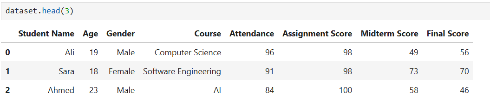
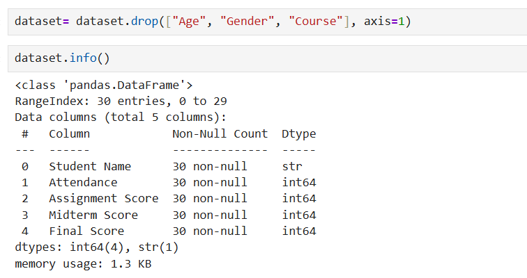
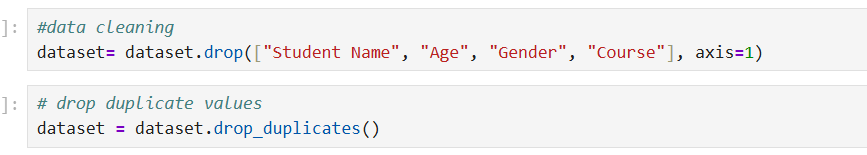
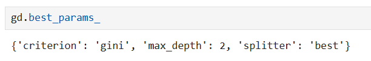
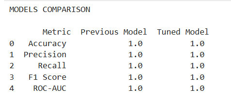

# Decision Tree Hyperparameter Tuning for Student Performance Prediction

## Overview
This project demonstrates how to improve the performance of a Decision Tree Classifier by applying data preprocessing, feature scaling, and hyperparameter tuning using GridSearchCV.
The objective is to predict whether a student will Pass or Fail based on academic performance metrics and compare the performance of the default Decision Tree model with an optimized (tuned) Decision Tree model.

# Features
* Load and preprocess student performance data
* Remove unnecessary features
* Create a binary target variable (Pass/Fail)
* Train a baseline Decision Tree Classifier
* Standardize input features
* Perform hyperparameter tuning using GridSearchCV
* Compare model performance using multiple evaluation metrics
* Visualize the comparison between the original and tuned models

# Technologies Used
* Python
* Pandas
* Matplotlib
* Scikit-learn
* Jupyter Notebook

# Dataset
The dataset contains student academic records with features including:
| Feature          | Description               |
| ---------------- | ------------------------- |
| Attendance       | Attendance percentage     |
| Assignment Score | Assignment marks          |
| Midterm Score    | Midterm examination marks |
| Final Score      | Final examination marks   |

A new target column, **Pass**, is created based on:
```python
Pass = Final Score > 50
```

Students scoring above 50 in the final exam are labeled as **True (Pass)**, otherwise **False (Fail)**.

# Project Workflow

## 1. Load Dataset
The dataset is loaded using Pandas.
```python
dataset = pd.read_csv(...)
```

## 2. Data Preprocessing
The notebook performs several preprocessing steps:

* Removed unnecessary columns:
  * Student Name
  * Age
  * Gender
  * Course
* Removed duplicate records
* Created the target variable (**Pass**)

## 3. Feature Selection
Input Features:
* Attendance
* Assignment Score
* Midterm Score
* Final Score

Target Variable:
* Pass

## 4. Train-Test Split
The dataset is divided into training and testing sets using `train_test_split()`.
* Initial split for the baseline model
* New split after preprocessing and scaling for the tuned model

## 5. Baseline Decision Tree
A default `DecisionTreeClassifier` is trained using the training data.
Predictions are generated on the test set and evaluated using several classification metrics.

## 6. Feature Scaling
The project applies **StandardScaler** before hyperparameter tuning.
```python
StandardScaler()
```
Scaled features are then used to train the optimized model.

## 7. Hyperparameter Tuning
`GridSearchCV` is used with 5-fold cross-validation to find the best Decision Tree parameters.

The following hyperparameters are searched:
* criterion
  * gini
  * entropy
  * log_loss

* splitter
  * best
  * random
    
* max_depth
  * Multiple depth values

The best-performing parameter combination is selected automatically.

## 8. Tuned Decision Tree
The optimized Decision Tree model obtained from GridSearchCV is used to make predictions on the test dataset.

# Model Evaluation
Both the baseline and tuned models are evaluated using:
* Accuracy
* Precision
* Recall
* F1 Score
* ROC-AUC Score

These metrics are stored in a Pandas DataFrame for comparison.

# Visualization
The notebook creates a **bar chart** comparing the baseline and tuned Decision Tree models across all evaluation metrics.
This visualization makes it easy to observe the improvements achieved through hyperparameter tuning.

# Project Structure
```text
Decision-Tree-Hyperparameter-Tuning/
│
├── Day6-PracticalTask.ipynb
├── student_performance.csv
├── README.md
├── requirements.txt
└── screenshots/
    ├── dataset_preview.png
    ├── preprocessing.png
    ├── best_parameters.png
    ├── model_metrics.png
    └── comparison_graph.png
```

# Setup Instructions

## 1. Clone the Repository
```bash
git clone https://github.com/farheenfatima-git/Day6-Task
```

## 2. Navigate to the Project Directory

```bash
cd Day6-Task
```

## 3. Create a Virtual Environment (Optional)
### Windows
```bash
python -m venv venv
venv\Scripts\activate
```

### macOS/Linux
```bash
python3 -m venv venv
source venv/bin/activate
```

## 4. Install Dependencies
Using requirements.txt:
```bash
pip install -r requirements.txt
```

Or install manually:
```bash
pip install pandas matplotlib scikit-learn jupyter
```

## 5. Launch Jupyter Notebook
```bash
jupyter notebook
```

Open:
```text
Day6-PracticalTask.ipynb
```

Run all cells in order.

# Suggested Screenshots

1. **Dataset Preview**
   * 

2. **Dataset Information**
   * 

3. **Data Cleaning**
   * 

4. **Best Hyperparameters**
   * 

5. **Performance Comparison**
   * 

6. **Comparison Graph**
   * !Comparison Graph](screenshots/comparison_graph.png)

# Learning Outcomes
Through this project, I learned how to:
* Prepare data for machine learning
* Create target variables
* Build a Decision Tree classifier
* Apply feature scaling
* Perform hyperparameter tuning with GridSearchCV
* Use cross-validation
* Compare classification models using multiple evaluation metrics
* Visualize model performance

# Future Improvements
* Evaluate additional classification algorithms
* Perform feature engineering
* Use Random Forest and Gradient Boosting models
* Implement Stratified Cross Validation
* Deploy the trained model using Streamlit or Flask

# Author
**Farheen F.**

Computer Science Student | Machine Learning Enthusiast
